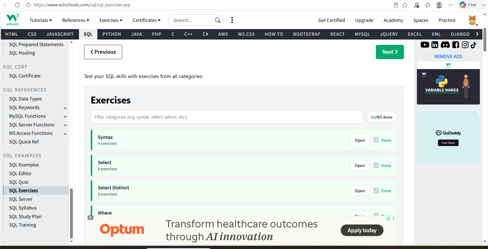

# SQL Exercises & Practice

## Overview

This repository showcases my SQL learning and hands-on practice completed as part of my Data Analyst journey.

I completed all 5 levels of SQL practice, progressing from SQL fundamentals to advanced SQL and analytical problem-solving.

## SQL Practice Levels

### Level 1 – SQL Fundamentals
**Platform:** W3Schools

Completed exercises covering:
- SELECT
- WHERE
- ORDER BY
- INSERT
- NULL
- UPDATE
- DELETE
- SQL Functions
- LIKE
- Wildcards
- IN
- BETWEEN
- ALIAS
- JOIN
- GROUP BY
- Database concepts

### Level 2 – SQL Practice
**Platform:** SQL-Practice

Completed Easy, Medium and Hard category exercises covering:
- CASE
- DISTINCT
- GROUP BY
- HAVING
- IN
- JOIN
- LIKE
- NULL
- UNION
- WHERE
- COUNT
- AVG
- SUM
- MAX
- MIN

### Level 3 – HackerRank
**Platform:** HackerRank

Completed Basic SQL challenges covering:
- SELECT queries
- Filtering
- Sorting
- City-related queries
- Weather Observation queries
- Employee queries
- Salary-related queries

### Level 4 – Advanced SQL
**Platform:** DataLemur

Practiced advanced SQL problems involving:
- Subqueries
- Complex JOINs
- Aggregations
- Ranking
- Window functions
- Analytical SQL
- Business-oriented problem solving

### Level 5 – SQL Challenges
**Platform:** DataLemur

Completed SQL challenges involving:
- Data analysis
- JOINs
- Aggregations
- Window functions
- Business analytics
- Advanced SQL problem solving

## Skills Demonstrated

- SQL
- Data Filtering
- Sorting
- Aggregation
- GROUP BY & HAVING
- JOINs
- CASE Statements
- Subqueries
- Window Functions
- Ranking
- Analytical Problem Solving

## Project File

📄 [View SQL Exercises](./SQL_Exercises.sql)

## Learning Outcome

This practice strengthened my ability to write SQL queries, analyze relational data, solve analytical problems and apply SQL concepts to Data Analyst interview-style questions.

## Completion Status

**Completed – All 5 SQL Practice Levels**

## Completion Evidence

Completed **60/60 SQL exercises** on W3Schools.
## Level 1

### Level 2 – SQL Practice

Completed all required SQL exercises across Easy, Medium and Hard difficulty levels using the Hospital database.

